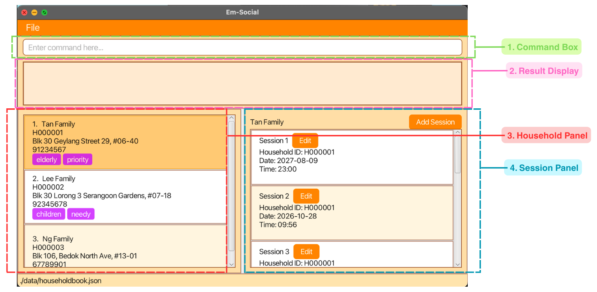
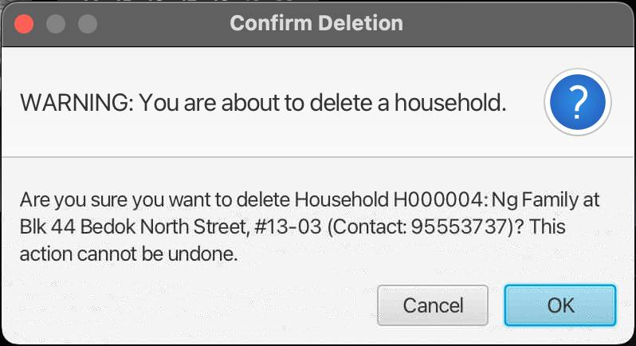
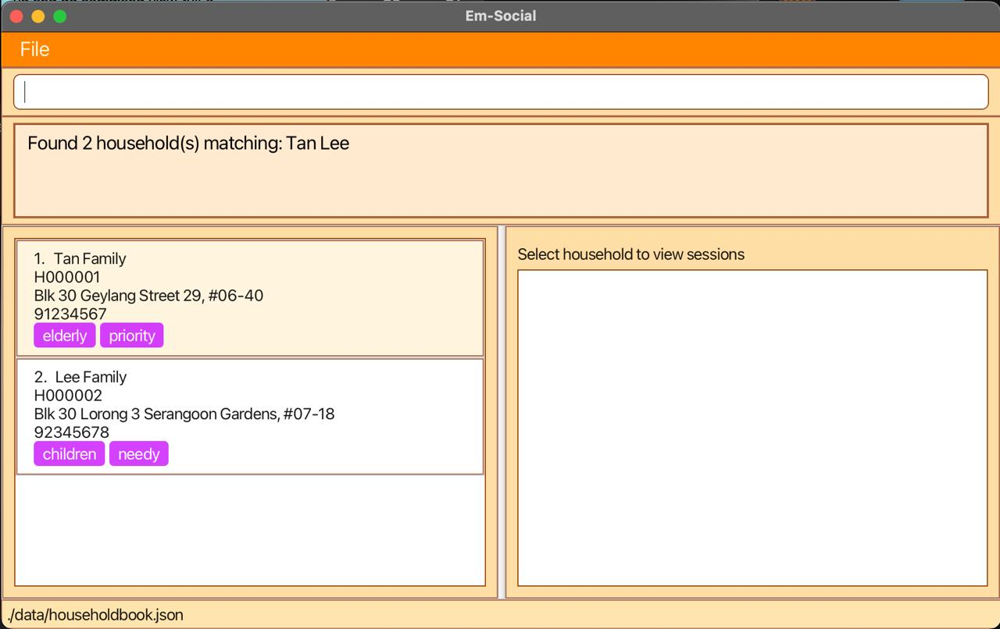
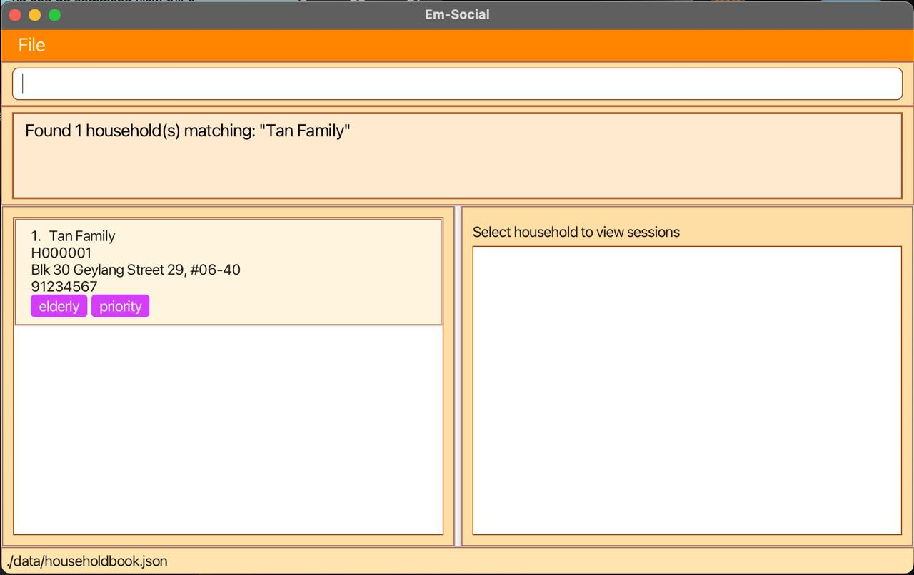
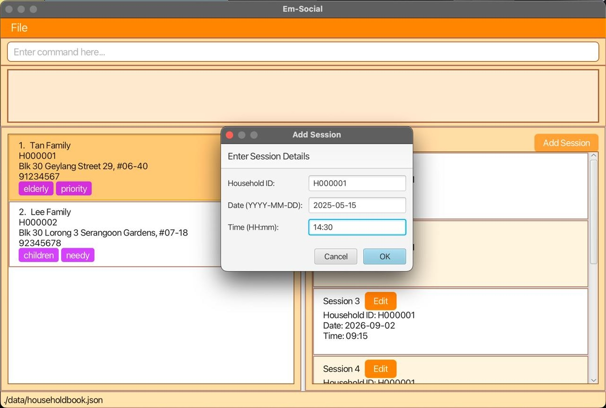
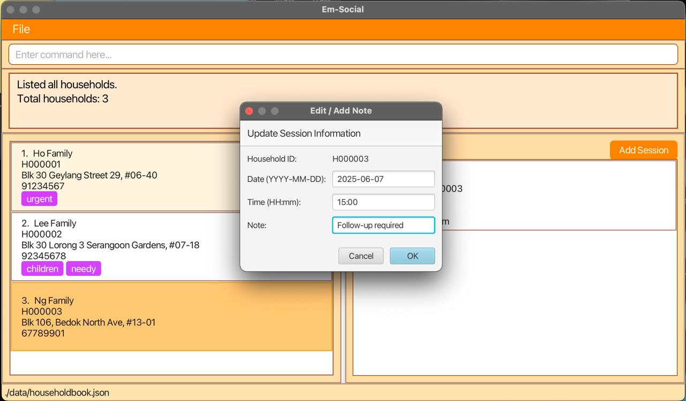
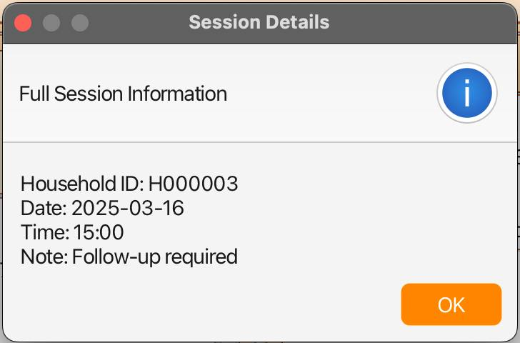
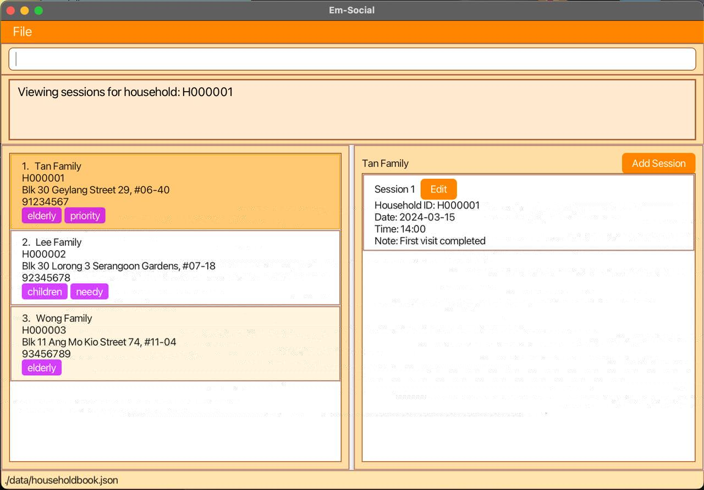
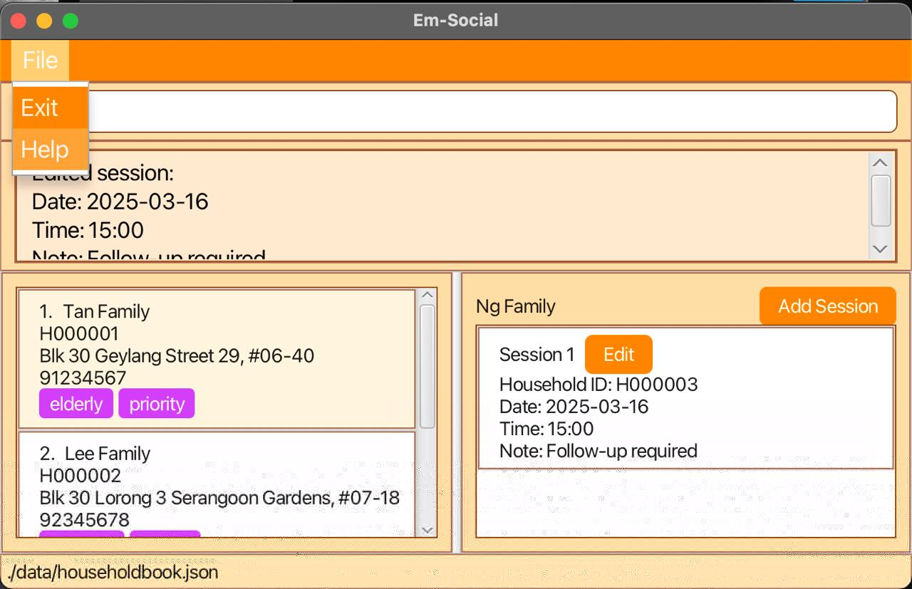
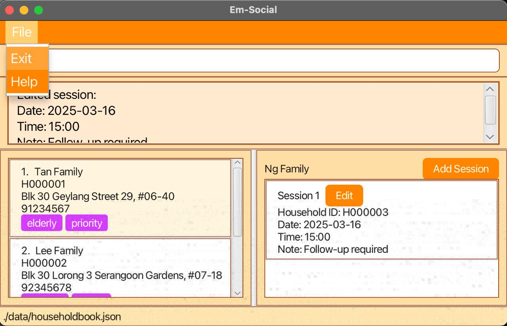

# Em-Social User Guide

## Introduction
Welcome to **Em-Social**, a **desktop application** designed to streamline **scheduling** and **household management** for social service workers!
Built for **fast, efficient use** via a Command Line Interface (CLI), Em-Social lets you **organise, categorise, and access your schedules and household records** with unmatched speed and precision.

### Who is Em-Social for?
Em-Social is designed specifically for social workers in **Singapore** who:
1. Manage **multiple** household cases simultaneously
2. Need to schedule and track **regular** home visits
3. Require a **simple** way to maintain case notes and follow-ups
4. Work in community service centers or family service centers
5. Need a **lightweight** solution that works offline

Em-Social thereby frees you up to focus on what matters most: **supporting the communities you serve!**

### Assumptions about our users
We assume our users:
1. Are comfortable with basic typing and text-based commands
2. Comfortable **navigating** through files/ folders
3. Comfortable **installing** programs from the internet
4. Prefer keyboard-based workflows to extensive mouse navigation
5. Need to quickly enter and retrieve information during busy workdays
6. May have limited technical support in their workplace

If you're already familiar with similar applications, skip to [Quick Start](#quick-start) for setup instructions.

## Table of Contents
- [Em-Social User Guide](#em-social-user-guide)
   - [Introduction](#introduction)
   - [Quick Start](#quick-start)
   - [User Interface Overview](#user-interface-overview)
   - [Household Management](#household-management)
      - [Add a household](#add-a-household): `add`
      - [Edit a household](#edit-a-household): `edit`
      - [Delete a household](#delete-a-household): `delete`
      - [Find households](#find-households): `find`
      - [List all households](#list-all-households): `list`
   - [Session Management](#session-management)
      - [Add a session](#add-a-session): `add-s`
      - [Edit a session](#edit-a-session): `edit-s`
      - [Delete a session](#delete-a-session): `delete-s`
      - [View full session](#view-full-session): `view-full-s`
      - [View household sessions](#view-s): `view-s`
   - [General Commands](#general-commands)
      - [Clear data](#clear-data)
      - [Help](#help)
      - [Exiting the program](#exiting-the-program)
   - [Tips for Effective Use](#tips-for-effective-use)
   - [Frequently Asked Questions](#frequently-asked-questions)
   - [Glossary](#glossary)
   - [Command Summary](#command-summary)

--------------------------------------------------------------------------------------------------------------------

## Quick Start

1. **Ensure Java is Installed**  
   Make sure you have Java `17` or a newer version installed on your computer. To check your Java version, open your terminal and type:
   ```bash
   java -version
   ```
   If Java is not installed or you have an older version, download and install the latest version from [this link](https://www.oracle.com/java/technologies/javase-jdk17-downloads.html).

2. **Download Em-Social**  
   Download the latest release of Em-Social from the [Em-Social releases page](https://github.com/AY2425S2-CS2103T-F10-2/tp/releases). Look for the latest `em-social.jar` file in the list of assets.

3. **Save the Downloaded File**  
   Move the downloaded `em-social.jar` file to the folder where you want to keep Em-Social. This could be your Desktop or a dedicated folder for the application.

4. **Open a Command Terminal**  
   Open a command terminal on your computer:
    - **Windows:** Press `Win + R`, type `cmd`, and press `Enter`.
    - **macOS:** Press `Cmd + Space`, type `Terminal`, and press `Enter`.
    - **Linux:** Press `Ctrl + Alt + T`.

5. **Navigate to the Application Folder**  
   In your terminal, navigate to the folder where you saved the `em-social.jar` file using the `cd` command. For example:
    - **Windows:**
      ```bash
      cd C:\Users\YourName\Desktop\Em-Social
      ```
    - **macOS/Linux:**
      ```bash
      cd /Users/YourName/Desktop/Em-Social
      ```

6. **Run Em-Social**  
   Launch the application by typing the following command in the terminal and pressing `Enter`:
   ```bash
   java -jar em-social.jar
   ```
   Within a few seconds, a graphical user interface (GUI) should appear. The application will start with sample data to help you get familiar with its features.

7. **Get Started with Commands**  
   Once the application is running, type `help` in the command box and press `Enter` to see a list of available commands.Some command examples:
    - **`list`**: Lists all households.
    - **`add`**: Adds a new household.
    - **`edit`**: Edits an existing household.

Now you're ready to start using Em-Social!

--------------------------------------------------------------------------------------------------------------------

## User Interface Overview



The Em-Social interface consists of five main sections:

1. **Household Panel** - Displays all households in your database
2. **Session Panel** - Shows sessions for the selected household
3. **Command Box** - Where you type commands
4. **Result Display** - Shows feedback from your commands

--------------------------------------------------------------------------------------------------------------------

<div style="border-left: 4px solid #007ACC; padding: 0.75em 1em; background-color: #f0f8ff;">

🔍 <strong>Before We Begin:</strong>

<ul>
  <li>For commands that do not take in parameters (<code>help</code>, <code>list</code>, <code>clear</code>, <code>exit</code>), additional text after the command will be <strong>ignored</strong>.<br>
  <em>e.g.</em> <code>help 123</code> will be processed as <code>help</code></li>

  <li>For commands that do take in parameters, multiple instances of the same parameter are allowed. With the exception of tags, Em-Social will only process the <strong>last instance</strong> of the parameter. Multiple tags are allowed.<br>
  <em>e.g.</em> <code>add n/johnson n/robinson a/Tanglin Road p/91283882</code> will result in <code>robinson</code> being added as the household name, not <code>johnson</code></li>

  <li>To safeguard against accidental typos, double command words will result in the <strong>initial command</strong> being processed.<br>
  <em>e.g.</em> <code>edit edit id/H000001 n/Johnson</code> will be processed as <code>edit id/H000001 n/Johnson</code><br>
  <em>e.g.</em> <code>add edit n/Robertson a/Robinson Quay p/91283844</code> will be processed as <code>add n/Robertson a/Robinson Quay p/91283844</code></li>

  <li>If a specific parameter is erroneous, the rest of the command will be ignored and the initial error will be displayed to you.<br>
  <em>e.g.</em> <code>add n/bert$ a/ p/</code> will return the error <code>Names may only contain alphanumeric characters or spaces, slashes (/), apostrophes ('), and dashes (-).</code> even though the empty <code>a/</code> and <code>p/</code> fields are also invalid.</li>
</ul>

</div>

## Household Management
Households are the core entities in Em-Social. Each household represents a family or living unit that you work with.

### Add a household
You can add a new household with the `add` command.
```
add n/HOUSEHOLD_NAME a/ADDRESS p/PHONE_NUMBER [t/TAG]...
```

Parameters:
- `n/HOUSEHOLD_NAME`: Name of the household (e.g., family name)
- `a/ADDRESS`: Physical address of the household
- `p/PHONE_NUMBER`: Contact number for the household
- `[t/TAG]...`: Optional tags to categorize the household (e.g., elderly, priority)

Example of usage:
```
add n/Ng Family a/Blk 44 Bedok North Street, #13-03 p/95553737
```

Expected outcome:
```
New household added: Household H000004: Ng Family at Blk 44 Bedok North Street, #13-03 (Contact: 95553737)
```


Examples accommodating unique names and different phone number formats:
```
add n/Conor O'Brien a/Charleson Road p/81277882
add n/Viknesh s/o Balakrishnan a/24 Nassim Hill p/62930129
```

> **Tip**: Utilize the edit command **below** to categorize households added with tags.

---

### Edit a household
You can modify household details with the `edit` command.
```
edit id/HOUSEHOLD_ID [n/HOUSEHOLD_NAME] [a/ADDRESS] [p/PHONE_NUMBER] [t/TAG]...
```

Parameters:
- `id/HOUSEHOLD_ID`: The household ID (e.g., H000001)
- `[n/HOUSEHOLD_NAME]`: Optional new name for the household
- `[a/ADDRESS]`: Optional new address
- `[p/PHONE_NUMBER]`: Optional new contact number
- `[t/TAG]...`: Optional tags (will replace all existing tags)

Example of usage:
```
edit id/H000001 n/Tan Family p/98765432 t/Urgent
```

Expected outcome:
```
Edited Household: Household H000001: Tan Family at Blk 30 Geylang Street 29, #06-40 (Contact: 98765432) Tags: [Urgent]
```

> **Warning**: Editing a household to match an existing household will be rejected to prevent duplicate households.
> 
> **Warning**: Existing values will be overwritten by the input values.

> **Tip**: Use meaningful tags to categorize households for easier filtering later. Common tags might include "elderly", "children", "financial-assistance", or "priority".

---

### Delete a household
You can remove a household with the `delete` command.
```
delete id/HOUSEHOLD_ID
```

Example of usage:
```
delete id/H000004
```

The following confirmation dialog box will appear:


Upon confirmation, you will see this message:
```
Deleted Household: Household H000004: Ng Family at Blk 44 Bedok North Street, #13-03 (Contact: 95553737)
```

> **Warning**: Deleting a household will also delete all associated sessions. This action cannot be undone.

---

### Find households
You can search for households with the `find` command.
Use double quotes to search for a key phrase.
> **Note**: You **cannot** search for session content (including notes) or household IDs using this command.


```
find KEYWORD [MORE_KEYWORDS]...
```

Parameters:
- `KEYWORD`: Search term to match against household names, addresses, or tags
- `""`: (double quotes) for exact phrase matching (e.g "Tan Family")

Example of usage:
```
find Tan Lee
```

Expected outcome:
```
Found 2 household(s) matching: Tan Lee
```



> **Tip**: Use double quotes for exact phrase matching: `"Tan Family"`

Example of usage (with phrase matching):
```
find "Tan Family"
```

Expected outcome (with phrase matching):
```
1 households found:
1. Tan Family (ID: H000001)
```



> **Tip**: The search is case-insensitive and matches partial words. For example, "Tan" will match "Tan Family" and "Tanaka".

> **Tip**: Use the [list](#list-all-households) command to refresh your view after searching or filtering.

---

### List all households
You can view all households with the `list` command.
```
list
```

Expected outcome (System Message):
```
Listed all households.
Total households: 4
```


--------------------------------------------------------------------------------------------------------------------

## Session Management
Sessions represent scheduled visits or meetings with households.

### Add a session
You can schedule a session with the `add-s` command.
```
add-s id/HOUSEHOLD_ID d/DATE tm/TIME
```

Parameters:
- `id/HOUSEHOLD_ID`: The household ID (e.g., H000001)
- `d/DATE`: Date in YYYY-MM-DD format
- `tm/TIME`: Time in 24-hour format (HH:MM)

Example of usage:
```
add-s id/H000001 d/2025-05-15 tm/14:30
```
Similarly, you can use the GUI:



Expected outcome:
```
New session added to household H000001: Session for H000001 on 2025-05-15 at 14:30
```

> **Warning**: The system will prevent double-booking if you already have another session scheduled at the same time.

---

### Edit a session
You can modify a session with the `edit-s` command.  
*Internal whitespaces between the ```HOUSEHOLD_ID``` and ```SESSION_INDEX``` will be trimmed.*  
```
edit-s id/HOUSEHOLD_ID-SESSION_INDEX d/DATE tm/TIME [n/NOTE]
```

Parameters:
- `id/HOUSEHOLD_ID-SESSION_INDEX`: Household ID and session index (e.g., H000001-1)
- `d/DATE`: New date in YYYY-MM-DD format
- `tm/TIME`: New time in 24-hour format (HH:MM)
- `[n/NOTE]`: Optional note about the session

Example of usage (with note):
```
edit-s id/H000003-1 d/2025-03-16 tm/15:00 n/Follow-up required
```

Similarly, you can also use the GUI:



Expected outcome:
```
Edited session:
Date: 2025-03-16
Time: 15:00
Note: Follow-up required
```


> **Warning**: Existing values will be overwritten by the input values.

> **Tip**: Use session notes to record key discussion points, action items, or observations during your visit.

---

### Delete a session
You can remove a session with the `delete-s` command.
```
delete-s id/HOUSEHOLD_ID-SESSION_INDEX
```

Parameters:
- `id/HOUSEHOLD_ID-SESSION_INDEX`: Household ID and session index (e.g., H000001-1)

Example of usage:
```
delete-s id/H000001-1
```

Expected outcome:
```
Deleted session 1 from household H000001: Session for H000001 on 2025-03-16 at 15:00
```

---
### View full session
You can view the full session details using the `view-full-s` command. *Internal whitespaces between the ```HOUSEHOLD_ID``` and ```SESSION_INDEX``` will be trimmed.*
```
view-full-s id/HOUSEHOLD_ID-SESSION_INDEX
```

Parameters:
- `id/HOUSEHOLD_ID-SESSION_INDEX`: Household ID and session index (e.g., H000001-1)

Example of usage:
```
view-full-s id/H000003-1
```

Expected outcome:
```
Viewing session 1 in full.
```



> **Tip**: Use this command to view your session notes elaborately

---

### View household sessions
You can switch to view **all** existing sessions for a household using the `view-s` command.
```
view-s id/HOUSEHOLD_ID
```

Parameters:
- `id/HOUSEHOLD_ID`: The household ID (e.g., H000001)

Example of usage:
```
view-s id/H000001
```

Expected outcome:
```
Viewing sessions for household: H000001
```



--------------------------------------------------------------------------------------------------------------------

## General Commands

### Clear data
You can clear **all** household and session data with the `clear` command.
```
clear
```

The following confirmation dialog box will appear:


Upon confirmation, you will see this message:
```
All entries have been cleared.
```

> **Warning**: This action will delete ALL households and sessions. It cannot be undone.

---

### Help
You can view a summary of available commands with the `help` command.
```
help
```

Similarly, you can use the UI button:



---

### Exiting the program
You can exit Em-Social with the `exit` command.
```
exit
```

Similarly, you can use the UI button:



--------------------------------------------------------------------------------------------------------------------

## Tips for Effective Use

1. **Warnings**
Em-Social performs certain actions that cannot be undone once confirmed. Please take note of the following:
   - ⚠️ **Deleting a household or session is irreversible.**
   - ⚠️ **Using the `clear` command will remove all data from the system.** Only use it if you're sure you want to start fresh.
   - The system does not prompt for confirmation when editing data, so always double-check your input before submitting.

2. **Tagging Strategy**
   - Use consistent tags across households for better organization
   - Consider tags for case type (e.g., `financial`, `medical`, `housing`)
   - Use tags for priority levels (e.g., `urgent`, `follow-up`, `completed`)
   - Add tags for special needs (e.g., `elderly`, `children`, `disability`)

3. **Session Planning**
   - Schedule sessions at least 30 minutes apart to allow for travel time
   - Add detailed notes immediately after sessions while details are fresh
   - Use the list-sessions command to review your upcoming schedule

4. **Data Management**
   - While Em-Social automatically saves data to a local file after each command, consider:
   - Regularly backing up your data file (located at `data/householdbook.json`)
   - Creating separate backups for different periods (monthly/quarterly)

5. **Efficient Workflows**
   - Group visits by geographic area to minimize travel time
   - Use the find command with area names to identify nearby cases
   - Add time estimates to session notes for better future planning

--------------------------------------------------------------------------------------------------------------------

## Frequently Asked Questions

**Q: Can I import data from other case management systems?**  
A: Currently, Em-Social doesn't support direct imports. You'll need to manually enter household information.

**Q: How many households can Em-Social handle?**  
A: Em-Social can efficiently manage hundreds of households, though performance may decrease with extremely large datasets (1000+).

**Q: Is my data secure?**  
A: Em-Social stores all data locally on your computer. No data is sent to external servers. For sensitive data, ensure your computer is secured with a password and consider encrypting your drive.

**Q: Can multiple social workers use Em-Social simultaneously?**  
A: Em-Social is designed for individual use. For team settings, each social worker should use their own instance of the application.

**Q: What happens if I accidentally delete a household?**  
A: Unfortunately, there's no built-in recovery for deleted households. This is why Em-Social asks for confirmation before deletion. Consider regular backups of your data file.

**Q: Why am I unable to create multiple households with the same name?**  
A: By preventing households with the same name or phone number from being saved, Em-Social ensures you save household details while **minimizing ambiguity**.  
For example, should you want to create multiple households named "John Lim", consider a more descriptive name such as "John Punggol" and "John Serangoon".  
As such, we aim to avoid the edge case where a single individual might have two households enrolled in a similar social work program.
*Note: This follows a similar convention that mobile contact applications follow.*

**Q: Why am I able to edit sessions to past dates?**
A: We understand that there are times when sessions with the households may be rearranged and not recorded Em-Social provides this functionality to  

**Q: Why am I able to add sessions one minute apart?**
A: What the session is depends on you! Because your sessions could vary from giving out hampers, a quick check in with the household or a more extensive session, we leave the duration to you!

**Q: How do I report bugs or request features?**
A: Please submit issues on our [GitHub repository](https://github.com/AY2425S2-CS2103T-F10-2/tp/issues).

--------------------------------------------------------------------------------------------------------------------

## Glossary

| Term                    | Definition                                                                                                             |
|-------------------------|------------------------------------------------------------------------------------------------------------------------|
| **Household**           | A family or living unit that receives social services, represented as a single entity in Em-Social.                    |
| **Household ID**        | A unique identifier (e.g., H000001) for each household.                                                                |
| **Session**             | A scheduled appointment between a social worker and a household for follow-up, assistance, or other social services.   |
| **Session Index**       | The number assigned to each session for a household, used in commands like `edit-s` or `delete-s`.                     |
| **Tag**                 | A keyword or label assigned to a household record to categorize or identify it easily.                                 |
| **Duplicate Household** | A household entry containing name, address, or contact information that already exists in another household entry.     |
| **Double-Booking**      | A scheduling conflict where two sessions are assigned to the same time slot, which Em-Social prevents automatically.   |
| **Case Notes**          | Detailed information recorded during or after a session, documenting observations, actions taken, and follow-up items. |
| **Command Box**         | The text input area at the bottom of the application where you type commands.                                          |
| **Confirmation Dialog** | A popup window that appears before irreversible actions.                                                               |
| **Result Display**      | The area that shows feedback after executing a command.                                                                |
| **Household Panel**     | The left section of the interface that displays the list of households.                                                |
| **Session Panel**       | The right section of the interface that shows sessions for the selected household.                                     |

--------------------------------------------------------------------------------------------------------------------

## Command Summary

<div class="wide-table">  <!-- Added container for better table control -->

| Action               | Command Format                                         | Examples                                                 |
|----------------------|--------------------------------------------------------|----------------------------------------------------------|
| **Add Household**    | `add n/NAME a/ADDRESS p/PHONE [t/TAG]...`              | `add n/Tan Family a/Blk 30 Geylang p/91234567 t/elderly` |
| **Edit Household**   | `edit id/ID [n/NAME] [a/ADDRESS] [p/PHONE] [t/TAG]...` | `edit id/H000001 n/Lim Family p/87654321`                |
| **Delete Household** | `delete id/ID`                                         | `delete id/H000001`                                      |
| **List Households**  | `list`                                                 | `list`                                                   |
| **Find Households**  | `find KEYWORD [MORE_KEYWORDS]...`                      | `find "Tan Lee"`                                         |
| **Add Session**      | `add-s id/ID d/DATE tm/TIME`                           | `add-s id/H000001 d/2025-05-15 tm/14:30`                 |
| **Edit Session**     | `edit-s id/ID-INDEX d/DATE tm/TIME [n/NOTE]`           | `edit-s id/H000001-1 d/2025-03-16 tm/15:00 n/Follow-up`  |
| **Delete Session**   | `delete-s id/ID-INDEX`                                 | `delete-s id/H000001-1`                                  |
| **View Sessions**    | `view-s id/ID`                                         | `view-s id/H000001`                                      |
| **Clear Data**       | `clear`                                                | `clear`                                                  |
| **Help**             | `help`                                                 | `help`                                                   |
| **Exit**             | `exit`                                                 | `exit`                                                   |
<div style="
    background: rgba(231, 245, 255, 0.4);
    border-left: 4px solid #4dabf7;
    padding: 1px 12px;
    margin: 8px 0;
    border-radius: 0 4px 4px 0;
">

**ℹ️ Note:** 
All command names and prefixes must be entered in lower case.

</div>
</div>

> **Legend**:
> - **UPPERCASE** terms: Replace with actual values
> - **[square brackets]**: Optional parameters
> - `...`: Can be repeated multiple times
> - `id/ID-INDEX`: Household ID followed by session number (e.g., H000001-1)
